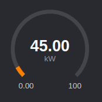

# React Gauge

Responsive react component gauge chart with SVG.

## Installation

```bash
npm install react-mygauge
```


## Usage

```tsx
import React from 'react';
import MyGauge from 'react-mygauge';

export default function App() {
    return <MyGauge
        min={0}
        max={100}
        value={75.18956}
        unit={'kW'}
        formatValue={(value) => value.toFixed(2)}
        animated
        settings={{
            container: {
                userSelect: 'none',
                display: 'flex',
                flex: 1,
                maxHeight: '7vw',
                maxWidth: '7vw',
                minHeight: '70px',
                minWidth: '70px',
                boxSizing: 'border-box',
            },
            text: {
                minAndMax: {
                    fill: 'rgba(255,255,255,0.75)',
                },
                unit: {
                    fill: 'rgba(255,255,255,0.5)',
                }
            },
            color: {
                gaugeBase: 'rgba(255,255,255,0.13)',
                gaugePercent: '#FF8000',
            }
        }}
    />
}
```


